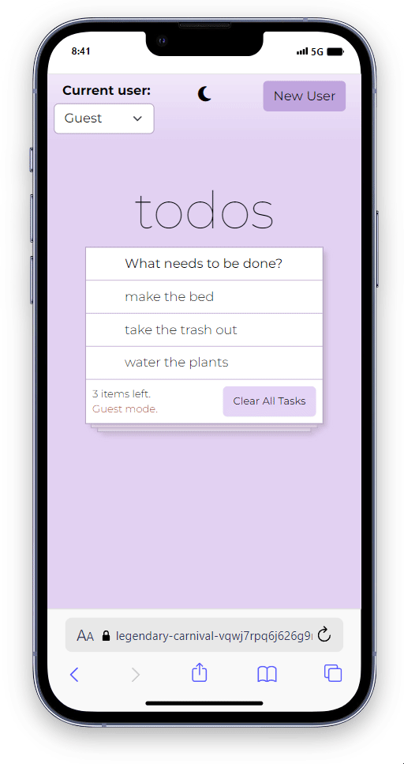

<h1>Todo List App</h1>
<h2>Overview</h2>
This is a simple todo list application built with React, featuring REST API integration for enhanced functionality. Users can create new accounts, manage tasks, and switch between light and dark themes.
<h4><a href="https://to-do-list-with-api.vercel.app/">Deployment</a></h4>
<h2>Features</h2>
<ul>
  <li><b>User Management:</b> Easily create new user accounts or use the guest mode.</li>
  <li><b>Task Management:</b> Add, delete, and view tasks effortlessly.</li>
  <li><b>Theme Switching:</b> Seamlessly switch between light and dark themes.</li>
 
</ul>
<h2>Technologies Used</h2>
<p align="center">
  <a href="https://skillicons.dev">
    
  </a>
</p>
<h2>Getting Started</h2>

1. Clone the repository:

```bash
git clone https://github.com/BlondyMartinez/ToDoList-with-API.git
```
2. Install dependencies:

```bash
cd ToDoList-with-API
npm install
```
3. Start the development server:
```bash
npm run start
```

<h2>Preview</h2>
<div style="display: flex; justify-content: center;">
  
</div>
